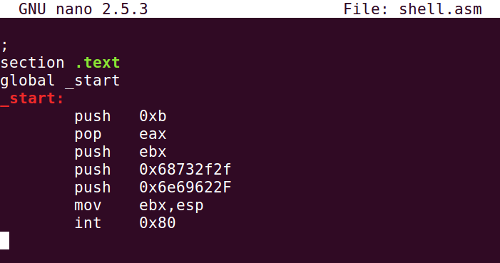
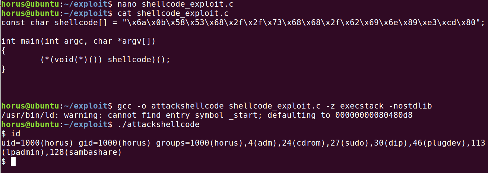

# EXPLOITATION WITH SHELLCODE

Shellcode is a piece of code performs specific action

Shellcode is written in ASM

Shellcode is architecture specific, so it is non portable between different processor types

Shellcode is typically written to directly manipulate processor registers to set them up for various system calls made with opcodes

When the ASM code has been written to perform the operation desired, it must then be converted to machine code and freed of any "null bytes" , because it must be free of any null bytes because many string operators such as strcpy() terminate when hitting them

-----

## SYSTEM CALLS (SYSCALL)

System call (commonly abbreviated to syscall) is the programmatic way in which a computer program requests a service from the kernel of the operating system on which it is executed

System calls provide an essential interface between a process and the operating system

System calls can only be made from userspace processes

Privileged system code also issues system calls

 An interrupt automatically puts the CPU into some elevated privilege level and then passes control to the kernel, which determines whether the calling program should be granted the requested service. If the service is granted, the kernel executes a specific set of instructions over which the calling program has no direct control, returns the privilege level to that of the calling program, and then returns control to the calling program.

System calls provide a way to manage communication to hardware and functionality offered by the kernel that may not be included in the application's address space

Most systems use ring levels(commonly 4 privileged levels) to provide security and protection from allowing an application to directly access hardware and certain system functions

For a user-level program to access a function outside of its address space, such as setuid(), it must identify the system call number of the desired function and then send an interrupt 0x80 (int 0x80)

#### NOTE
	The instruction 'int 0x80/syscall' is an assembly instruction that invokes system calls on most *NIX OSs

#### WHY SYSCALL?

To enter kernel we can use Hardware Interrupt, Hardware Trap and Software Initiated Trap

We cannot trigger and use hardware related interrupts and traps

So lets use "Software Initiated Traps" to enter Kernel Mode

Systemcalls are a special case of software initiated trap. The machine instruction used to initiate a system call typically causes a hardware trap that is handled specially by the kernel

In Linux, the system calls are implemented using

	lcall7/lcall27 gates (lcall7_func)
	int0x80 (software interrupt)

#### WORK FLOW

To perform a syscall , two or more arguments are required

The "syscall number" is loaded into "EAX register"

Arguments needed to be passed through syscall are stored in registers EBX,ECX and EDX(32bit) in the order followed by syscall table

In case of 64bit, QWORD registers and R8-R15 registers are used to store the arguments

### GENERATING A SAMPLE ASM CODE FOR SYSCALL

#### EXAMPLE 1

Lets trigger the exit(0) using syscall by ASM

```
mov eax,1
mov ebx,0
int 0x80
```

Here EAX is loaded with 1, so it get the syscall with value 1

syscall_value = 1 -----> syscall = sys_exit()

The value 0 is loaded into EBX so that it can be used as argument for syscall

int 0x80 is used to trigger interrupt and perform syscall

#### EXAMPLE 2

To spawn a "sh" shell using execve()

```
mov eax,0x0 		//initialization
push edx 			//nullbyte to terminate string (0x0)
push 0x68732f2f 	//4bytes needed (//sh)['//' is same as '/'] little endian
push 0x6e69622f 	//4bytes needed (/bin) little endian
mov ebx, esp 		//moving SP into EBX
push edx 			//pushing EDX into stack (0x0)
push esp 			// ESP above EDX in stack
mov ecx, esp 		// ESP stored in ECX for argv
mov eax, 0x0b 		//loading eax with syscall value for execve()
int 0x80 			//calling syscall to perform interrupt
```


### MORE ON SYSCALL

Type this command in terminal

```
man syscall
man 'syscall(2)'
```

Also refer this [table](https://chromium.googlesource.com/chromiumos/docs/+/master/constants/syscalls.md) for more syscall values of each architecture

-----

## NULLBYTES 0x00

### EFFECT OF NULL BYTES

Functions relying on a string operator such as strcpy() or gets() to copy data into a buffer, and when these functions hit a null byte such as 0x00, they translate that as a string terminator. This, of course, causes our shellcode to fail

### CAUSE OF NULL BYTES

Assembly instructions cause null bytes to reside within your shellcode

Improper initialization of registers

### REMOVING NULL BYTES

#### TYPE 1

Consider you are using a register EAX (32bits/4bytes)

Whenever you are trying to store a small value in EAX(32bit)

```
mov eax,0x10
```

You can use AX(16bit) to store these small values(based on size)

Lower register AL(8bit) gets filled with values and Upper register AH(8bit) gets filled with NULLS

This causes null bytes when converting it into shellcode

Instead of loading small values in the whole register,

###### We can use its halves

```
mov al,0x10
```

#### TYPE 2

There comes a case in which we need to pass 0 as an argument to syscall

In that type of cases we could not load 0 into register, because it may create NULL BYTES in shellcode

To overcome this, we can store any arbitrary values in register and,

###### We can XOR the register

```
mov ebx,0x10
xor ebx,ebx
```

It is the best way because it does not affect the EFLAGS register

#### TYPE 3

###### We can SUB the register

```
mov ebx,0x10
sub ebx,ebx
```

#### TYPE 4

###### INC or DEC the register

Storing the count value in ECX

Performing INC(Increment) and DEC(Decrement)

```
inc ebx
dec edx
```

#### TYPE 5

###### Moving 0 from another register

Lets assume 0x00 is in EDX

To load the value in EBX and to prevent null bytes

```
mov ebx,edx
```

-----

## GENERATING SHELLCODES

Lets assume a scenario where we want to call/spawn a shell from a attack vector

To spwan a shell we need to execute shellcode

And lets fix that we need to spawn "/bin/sh" 

Lets replica this [execve shellcode](https://www.exploit-db.com/exploits/44321)


### COMMON CODE STRUCTURE

Common code structure to execute our shellcode using C program as an exploit is

```
char shellcode[] = "SHELLCODE HERE";
int main(int argc, char **argv){
	int (*attack)();
	attack = (int (*)())shellcode;
	(int)(*attack)();
}
```

OR

```
char shellcode[] = "SHELLCODE HERE";
int main(int argc, char **argv){
	((int (*)())shellcode)();
}
```

### EXPLOIT

Before we attack we need to check the architecture of the victim machine


Lets script the ASM code in editor to process it



Now,lets test the exploit generated from ASM code


Run "objdump" to view the hexvalues of each ASM instruction to craft shellcode


##### This is the SHELLCODE for our exploit

Copy the shellcode and embed it in another script so that it can run it in executable memory


Compile the source code with "-z execstack" and "-nostdlib" to avoid "segmentation fault" and allowing the binary to run in executable memory



### EXPLOIT IS DONE

#### Exploit Sample Is Given In GitHub Repo

#### [AidenPearce369](https://github.com/AidenPearce369/ExploitDev)